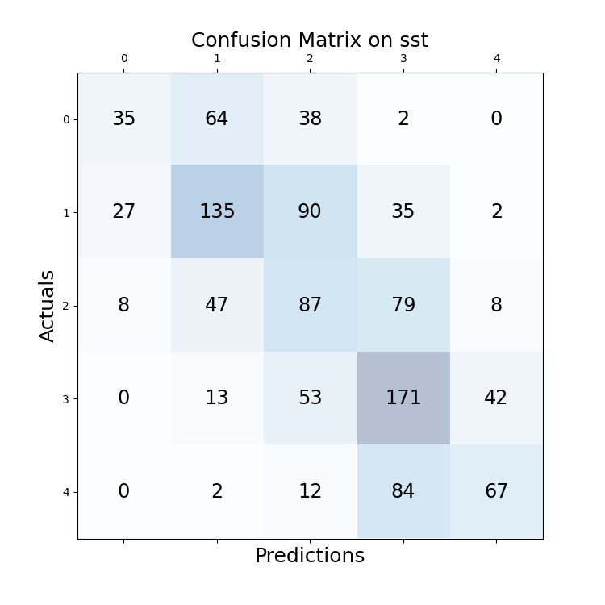
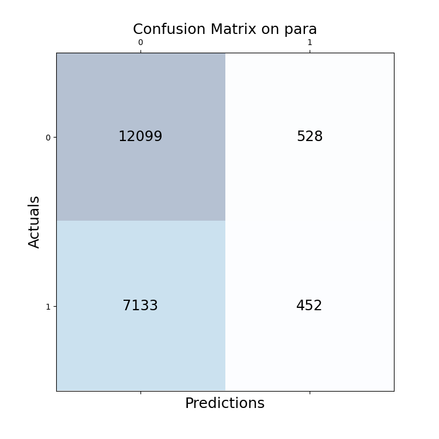

# G05 Language Ninjas

This repository is the Project for the Module M.Inf.2202 Deep Learning for Natural Language Processing of Group G05 Language Ninjas. 
The course description can be found [here](https://gipplab.org/deep-learning-for-natural-language-processing/). 
The project description can be found in SS23_DNLP_ProjectDescription.pdf

The goal for Part 1 is to implement a base BERT version including the AdamW optimizer and train it for sentiment analysis on Stanford Sentiment Treebank (SST). 
The goal for Part 2 is to implement multitask training for sentiment analysis on Stanford Sentiment Treebank (SST), paraphrase detection on Quora Question Pairs Dataset (QQP) and semantic textual similarity on SemEval STS Benchmark (STS).

## Methodology

### Part 1
We followed the instructions in the project description.

### Part 2
To create a baseline, we used the provided template and implemented a very basic model for all tasks. 
All tasks are trained on seperately. 
We achieved a training accuracy of nearly 100 %.
But dev_accuracy stopped improving early. 
So generalization is a problem.

Better generalization is typically achieved by regularization. 
First easy things to try are dropout and weight_decay. 
All tasks in the baseline share a common dropout layer. 
Since paraphrase detection and textual similarity are both about similarity, we tried to let them share an additional dropout layer for the second embeddings. 

Another approach for regularization is additional data. 
The provided datasets are imbalanced in the sense that paraphrase is by far the largest one and has the best dev accuracy in the baseline. 
Similarity and paraphrase are similar tasks, so we tried to compute cosine similarity and used this layer also in computing paraphrase detection. 
This way the similarity layer gets updated when training for paraphrase detection.

The training order in baseline is sts -> sst -> qqp. 
Since paraphrase has the largest dataset and performs best, we changed the training order to train on paraphrase first qqp -> sts -> sst.

SMART is an approach for regularization and uses adverserial learning. 
It adds noise to the original embeddings, calculates logits and an adverserial loss to the unperturbed logits. 
This adverserial loss is added to the original training loss. 
The parameters of the added noise, and therefore adverserial loss, are optimized during training.

Sophia is a new optimizer challenging the domination of Adam. 
We tried it and compare it to AdamW.

Another possibilty is to combine losses instead of training seperately. 
This can be as simple as adding them together. 
Since gradients for different tasks can lead in different directions, Gradient slicing

We used Optuna for hyperparameter tuning. We recorded regular trainings in Tensorboard. 
```
tensorboard --logdir ./minbert-default-final-project/runs
```
## Experiments

### Part 1

```
python classifier.py --use_gpu --batch_size 10 --lr 1e-5 --epochs 10 --option finetune
```
Tensorboard: Jul19_21-50-55_Part1

### Part 2 Baseline

We created a baseline for evaluation with
```
python multitask_classifier.py --use_gpu --batch_size 20 --lr 1e-5 --epochs 30 --option finetune
```
Tensorboard: Jul23_21-38-22_Part2_baseline

For creating the baseline, we simply trained the in part one implemented Bert model on all data sets using the AdamW optimizer from part one with the standard hyperparameters ($lr = 1e-05$, $(\beta_{1},\beta_{2}) = (0.9, 0.999)$). In each epoch we trained first on the whole Quora trainset, then on the whole SemEval trainset and finally on the whole SST trainset. We used Cross-Entropy loss on the Quora and SST trainset and on the SemEval set we used MSE-loss applied to the cosine similarity of the bert embeddings of the two input sentences.
To perform the paraphrasing and sentiment anaylsis task, a simple linear classifier layer was added on top of the BERT embeddings.

After 5 epochs no significant improvements in dev metrics. Train accuracy is nearly 100 % for every task.
The conclusion is overfitting.
We did another run and recorded the dev loss.

```
python -u multitask_classifier.py --use_gpu --option finetune --lr 1e-5 --batch_size 64 --comment "baseline" --epochs 30
```
Tensorboard: Aug25_10-01-58_ggpu136baseline

The dev metrics are a bit different this time. 
I DO NOT KNOW WHY. PLEASE CHECK.
The dev loss is going up after 5 epochs. This confirms overfitting.

### Sophia Optimizer

#### Implementation

[Paper](https://arxiv.org/abs/2305.14342) and [code](https://github.com/Liuhong99/Sophia)

The code for Sophia can be found in `optimizer.py`
We did one run with standard Sophia parameters and the same learning rate as AdamW

```
python -u multitask_classifier.py --use_gpu --option finetune --lr 1e-5 --optimizer "sophiag" --epochs 20 --comment "sophia" --batch_size 64
```
Tensorboard: Aug25_10-50-25_ggpu115sophia

The training performs very different for the different tasks.
- STS: the metrics and curves are similar to the baselines
- SST: training loss is similar to baseline. Other training metrics are worse.
- QQP: training metrics are similar to our first baseline. Dev metrics are more similar to the second baseline.

Two conclusions:
1. all tasks behave different and should therefor be trained with different parameters
2. AdamW and Sophia need different parameters

#### Comparison to AdamW

To compare both optimizers, we did an optuna study.
Training of three epochs in 100 trials with pruning. 
Comparison of Adam (learning rate, weight decay) and Sophia (learning rate, weight decay, rho, k) and their parameters.
```
python optuna_optimizer.py --use_gpu
```
Optuna: `./optuna/optimizer-*`
The slice plot shows that learning rate and weight decay should be larger for Sophia.

#### Tuning of Sophia

To find better Sophia parameters, we did an Optuna study.
Training of three epochs in 100 trials with pruning. 
A seperate optimizer for every task and tuning of learning rate, rho and weight decay.
```
python -u optuna_sophia.py --use_gpu --batch_size 64 --objective all
python -u optuna_sophia.py --use_gpu --batch_size 64 --objective para
python -u optuna_sophia.py --use_gpu --batch_size 64 --objective sst
python -u optuna_sophia.py --use_gpu --batch_size 64 --objective sts
``` 
Optuna: `./optuna/Sophia-*`

#### Adding Dropout Layers
Since the overfitting problem remained after the hyperparameter tuning, we added an individual loss layer for every task to reduce the overfitting. So, before the BERT embeddings were passed to the linear classifier layer of a task a dropout on the embeddings was applied. The dropout probability can be chosen differently for the different tasks. We tuned the dropout probabilities together with the learning rate and weight decay in another optuna study. We received the following dropout probabilities:
| Para Dropout       | SST Dropout | STS Dropout
| ------------------ |---------------- | -------------- 
|  15%  |     5.2 %         |      22 %       

We obtained the following results
| Model name         | SST accuracy | QQP accuracy | STS correlation |
| ------------------ |---------------- | -------------- | ---
| Sophia_base |     .. %         |      .. %       | .. % |
| Sophia_dropout  |     .. %         |      ..%       | ..%  |

To reproduce this result run: 
```
python -u multitask_classifier.py --use_gpu --option finetune  --optimizer "sophiag" --epochs 10 --hidden_dropout_prob_para 0.15 --hidden_dropout_prob_sst 0.052 --hidden_dropout_prob_sts 0.22 
--lr_para 1.8e-05 --lr_sst 5.6e-06 --lr_sts 1.1e-05 --weight_decay_para 0.038 --weight_decay_sst 0.17 --weight_decay_sts 0.22
--comment individual_dropout
```
The dropout layers ... the performance. 
The overfitting problem still exists

#### Seperate QQP training
The QQP dataset is way bigger than the other two datasets. 
Thus, we might overfit on the SemEval and SST dataset before the model is trained out on the QQP dataset.
To tackle this, we train the first 5 epochs only on the QQP dataset. The last epochs are trained on all datasets, but we only train on a randomly sampled tiny fraction of the QQP dataset, which has the same size as the other two datasets. The dropout layers and hyperparameters of the previous section were kept, since they should make the model more robust.
The following results were obtained:
| Model name         | SST accuracy | QQP accuracy | STS correlation |
| ------------------ |---------------- | -------------- | ---
| Sophia_base |     .. %         |      .. %       | .. % |
| Sophia_dropout  |     .. %         |      ..%       | ..%  |

Use the same command as in the previous section and add the argument  ```--para_sep True``` for reproducing the results.

That approach could improve the performance on the paraphrasing task by ... but we lost a few percentage points on the other task. So we conclude, on the on hand training on the QQP dataset first actually helps to gain more information from this huge dataset but on the other hand the three tasks seem to conflict each other. 

#### Tackle imbalanced data
The distribution of the different classes in the SST dataset is not equal (class one contains over two times more samples than class zero). As we see in the confusion matrix of our model, which was trained as in the previous section, many datapoints from class 0 are falsely predicted to be in class one (same problem with classes five and four). 



To balance the QQP and SST trainset we add weights to our Cross-Entropy loss function such that a training sample from a small class is assigned with an higher weight. This resulted in the following performance:
| Model name         | SST accuracy | QQP accuracy | STS correlation |
| ------------------ |---------------- | -------------- | ---
| Sophia_base |     .. %         |      .. %       | .. % |
| Sophia_dropout  |     .. %         |      ..%       | ..%  |

Use the same command as in the previous section and add the argument  ```--para_sep True --weights True``` for reproducing the results.

With this approach we could improve the performance on the SST dataset compared to the last section by ... . 

#### Additional layers
Another problem we earlier observed was that the task contradict each other, i.e. in separating QQP training the paraphrasing accuracy increased but the other to accuracies decreased. We try to solve these conflicts by adding a simple neural network with one hidden layer as classifier for each task instead of only a linear classifier. The idea is that each task gets more parameters to adjust which are not influenced by the other tasks. As activation function in the neuronal network we tested ReLu and tanh activation layers between the hidden layer and the output, but both options performed equally poor. 
| Model name         | SST train_accuracy | QQP train_accuracy | STS train_correlation |
| ------------------ |---------------- | -------------- | ---
| Sophia_base |     .. %         |      .. %       | .. % |
| Sophia_dropout  |     .. %         |      ..%       | ..%  |

Use the same command as in the previous section and add the argument  ```--para_sep True --weights True --add_layers True``` for reproducing the results.

The loss of all trainsets went down during training but the train accuracy didn't increase during the training. We conclude that the model with the additional layers gets overconfident on some correct samples. Thus, the predicted probabilities increase a lot during training. Resulting in decreasing loss during training while the train accuracy doesn't increase at all. The confusion matrix of the para set confirms this. The model predicts zero all the time, which indicates a high confidence in it's predictions:
 
 

Since we still have a strong overfitting problem and the additional layers didn't help at all we decided to not further experiment with this idea.
### SMART

#### Implementation

[Paper](https://aclanthology.org/2020.acl-main.197/) and [code](https://github.com/namisan/mt-dnn)

The perturbation code is in `smart_perturbation.py` with additional utilities in `smart_utils.py`
```
python -u multitask_classifier.py --use_gpu --option finetune --lr 1e-5 --optimizer "adamw" --epochs 20 --comment "smart" --batch_size 32 --smart
```
Tensorboard: Aug25_11-01-31_ggpu136smart

The traing metrics are similar to the baselines. The dev metrics are a bit better than the second baseline. 

#### Tuning 

Parameter (epsilon, step_size, noise_var, norm_p) tuning for SMART with optuna
Training of three epochs in 100 trials with pruning. 

```
python -u optuna_smart.py --use_gpu --batch_size 50 --objective all
python -u optuna_smart.py --use_gpu --batch_size 50 --objective para
python -u optuna_smart.py --use_gpu --batch_size 50 --objective sst
python -u optuna_smart.py --use_gpu --batch_size 50 --objective sts
```
Optuna: `./optuna/smart-*`
### Regularization

```
python -u optuna_regularization.py --use_gpu --batch_size 80
```
`./optuna/regularization-*`

TODO regularization with seperate dropout and weight_decays for each task

### Shared similarity layer
One layer of cosine similarity is used for both paraphrase detection and sentence similarity.

```
python -u multitask_classifier.py --use_gpu --option finetune --lr 1e-5 --shared --optimizer "adamw" --epochs 20 --comment "shared" --batch_size 64
```
Tensorboard: Aug25_09-53-27_ggpu137shared

### Combined Loss

Loss for every task is calculated. All losses are summed up and optimized.
```
python multitask_combined_loss.py --use_gpu
```
Tensorboard Aug23_17-45-56_combined_loss

The tasks seem to be too different to work well in this setup. The loss is going down as it should, but the predicted values are not good, seen in the dev_loss and dev_acc

### Gradient Surgery
Implementation from [Paper](https://arxiv.org/pdf/2001.06782.pdf) and [code](https://github.com/WeiChengTseng/Pytorch-PCGrad)

```
python -u multitask_combined_loss.py --use_gpu --batch_size 10 --pcgrad --epochs 15 --comment "pcgrad" --lr 1e-5 --optim "adamw" --batch_size 40
```
IT STOPS WHILE OPTIMIZING BECAUSE SOME LOGITS ARE NA
## Requirements

You can use `setup.sh` or `setup_gwdg.sh` to create an environment and install the needed packages. Added to standard project ones:

```
pip install tensorboard
pip install torch-tb-profiler
pip install optuna
```

## Training
- `multitask_classifier.py` is baseline training with seperate training for every task: sts -> sst -> qqp
- `multitask_combined_loss.py` combines losses by summing them up
- `multitask_order.py` trains paraphrase detection first: qqp -> sts -> sst
- `models.py`
    - `models.MultitaskBERT` class with basic layers for three tasks
    - `models.SharedMultitaskBERT` class where the similarity layer of the similarity task is also used for paraphrase detection
    - `models.SmartMultitaskBERT` class with basic multitask model modified to work with SMART

## Evaluation
- `evaluation.model_eval_multitask()`
- `evaluation.smart_eval()` function for evaluation modified to work with SMART
- `evaluation.optuna_eval()` function for basic evaluation to work with Optuna
- `evaluation.test_model_multitask()` and `evaluation. model_eval_test_multitask()` functions for submitting final results

## Pre-trained Models

You can download pretrained models in the original [Project repository](https://github.com/truas/minbert-default-final-project) 

## Results

Our model achieves the following performance on :

### Sentiment Analysis on Stanford Sentiment Treebank (SST)
### Paraphrase Detection on Quora Dataset (QPQ)

### Semantic Textual Similarity on SemEval STS Benchmark (STS)

| Model name         | SST accuracy | QQP accuracy | STS correlation |
| ------------------ |---------------- | -------------- | ---
| Baseline  |     51 %         |      85 %       | 52 % |
| State-of-the-Art  |     59.8 %         |      90.7%       | 93%  |

Here is the course [Leaderboard](https://docs.google.com/spreadsheets/d/1Bq21J3AnxyHJ9Wb9Ik9OXvtX6O4L2UdVX9Y9sBg7v8M/edit#gid=0).

[State-of-the-Art](https://paperswithcode.com/sota/sentiment-analysis-on-sst-5-fine-grained)

## Contributing

>📋  Pick a licence and describe how to contribute to your code repository. 

## Member Contributions
Dawor, Moataz:

Lübbers, Christopher L.: Part 1 complete; Part 2: Multitask classifier, Tensorboard (metrics + profiler), Baseline, SOPHIA, SMART, Optuna, Optuna for Optimizer, Optuna for SMART, Optuna for regularization, Multitask training with combinded losses, Multitask with gradient surgery, README for those tasks

Niegsch, Luaks*:

Schmidt, Finn Paul:

## Future work

give other losses different weights. 
with or without combined losses. 
maybe based in dev_acc performance in previous epoch.