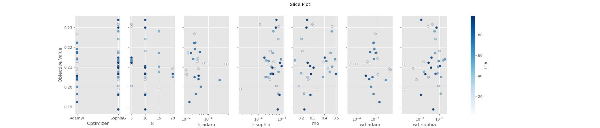
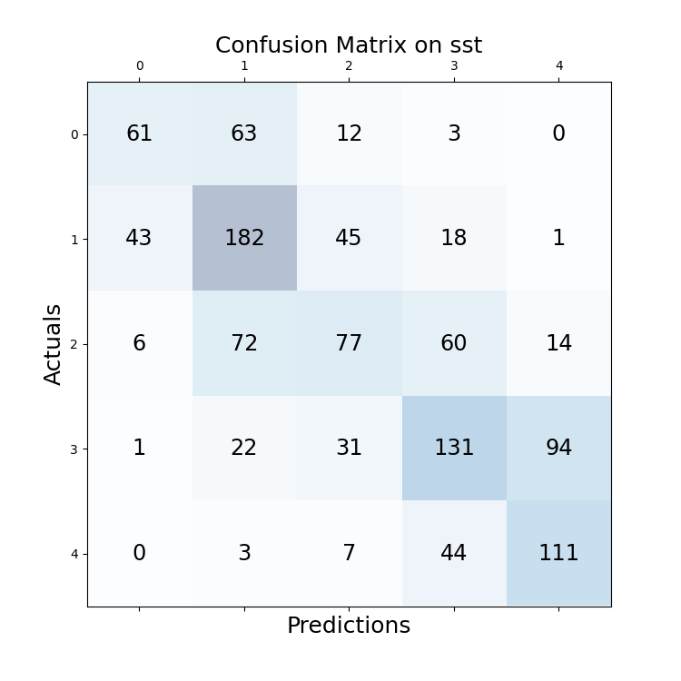

# G05 Language Ninjas

This repository is the Project for the Module M.Inf.2202 Deep Learning for Natural Language Processing of Group G05 Language Ninjas. 
The course description can be found [here](https://gipplab.org/deep-learning-for-natural-language-processing/). 
The project description can be found in SS23_DNLP_ProjectDescription.pdf

The goal for Part 1 is to implement a base BERT version including the AdamW optimizer and train it for sentiment analysis on Stanford Sentiment Treebank (SST). 
The goal for Part 2 is to implement multitask training for sentiment analysis on Stanford Sentiment Treebank (SST), paraphrase detection on Quora Question Pairs Dataset (QQP) and semantic textual similarity on SemEval STS Benchmark (STS).

## Methodology
### Part 1
We followed the instructions in the project description.

### sBERT
We first implemented sBERT and focused on improving the accuracy for the three tasks.

To create a baseline, we used the provided template and implemented a very basic model for all tasks. 
All tasks are trained on seperately. 
We achieved a training accuracy of nearly 100 %.
But dev_accuracy stopped improving early. 
So generalization is a problem.

Better generalization is typically achieved by regularization. 
First easy things to try are dropout and weight_decay. 
All tasks in the baseline share a common dropout layer. 
Since paraphrase detection and textual similarity are both about similarity, we tried to let them share an additional dropout layer for the second embeddings. 

Another approach for regularization is additional data. 
The provided datasets are imbalanced in the sense that paraphrase is by far the largest one and has the best dev accuracy in the baseline. 
Similarity and paraphrase are similar tasks, so we tried to compute cosine similarity and used this layer also in computing paraphrase detection. 
This way the similarity layer gets updated when training for paraphrase detection.

The training order in baseline is sts -> sst -> qqp. 
Since paraphrase has the largest dataset and performs best, we changed the training order to train on paraphrase first qqp -> sts -> sst.

SMART is an approach for regularization and uses adverserial learning. 
It adds noise to the original embeddings, calculates logits and an adverserial loss to the unperturbed logits. 
This adverserial loss is added to the original training loss. 
The parameters of the added noise, and therefore adverserial loss, are optimized during training.

Sophia is a new optimizer challenging the domination of Adam. 
We tried it and compare it to AdamW.

Another possibilty is to combine losses instead of training seperately. 
This can be as simple as adding them together. 
Since gradients for different tasks can lead in different directions, Gradient slicing

We used Optuna for hyperparameter tuning. We recorded regular trainings in Tensorboard. 
```
tensorboard --logdir ./minbert-default-final-project/runs
```
## Experiments

### Part 1

```
python classifier.py --use_gpu --batch_size 10 --lr 1e-5 --epochs 10 --option finetune
```
Tensorboard: Jul19_21-50-55_Part1
| Model name         | SST accuracy |
| ------------------ |---------------- | 
| BERT Base |     51.41 %         |    


### Part 2 sBERT

We started with sBERT. 
For creating the baseline, we simply trained the in part one implemented Bert model on all data sets using the AdamW optimizer from part one with the standard hyperparameters ($lr = 1e-05$, $(\beta_{1},\beta_{2}) = (0.9, 0.999)$). 
In each epoch we trained first on the whole Quora trainset, then on the whole SemEval trainset and finally on the whole SST trainset. 
We used Cross-Entropy loss on the Quora and SST trainset and on the SemEval set we used MSE-loss applied to the cosine similarity of the bert embeddings of the two input sentences.
To perform the paraphrasing and sentiment anaylsis task, a simple linear classifier layer was added on top of the BERT embeddings.
We changed the code, so you have to run it on a commit before 2023-07-24.
```
python multitask_classifier.py --use_gpu --batch_size 20 --lr 1e-5 --epochs 30 --option finetune --optimizer adamw
```
Tensorboard: Jul23_21-38-22_Part2_baseline

After 5 epochs no significant improvements in dev metrics. Train accuracy is nearly 100 % for every task.
The conclusion is overfitting.
We did another run to record the dev loss.
Please take care to use a commit from 2023-08-25 to reproduce the results.

```
python -u multitask_classifier.py --use_gpu --option finetune --lr 1e-5 --batch_size 64 --comment "baseline" --epochs 30
```
Tensorboard: Aug25_10-01-58_ggpu136baseline

The dev metrics are a bit different this time. 
The dev loss is going up after 5 epochs. This confirms overfitting.

| Model name         | SST accuracy | QQP accuracy | STS correlation |
| ------------------ |---------------- | -------------- | ---
| sBERT-Baseline_1 |     51.14 %         |      85.23 %       | 52.15 % |
| sBERT-Baseline_2  |     51.41 %         |      77. 32 %       | 43.35 %  |

### Sophia Optimizer

#### Implementation

[Paper](https://arxiv.org/abs/2305.14342) and [code](https://github.com/Liuhong99/Sophia)

The code for Sophia can be found in `optimizer.py`
We did one run with standard Sophia parameters and the same learning rate as AdamW

```
python -u multitask_classifier.py --use_gpu --option finetune --lr 1e-5 --optimizer "sophiag" --epochs 20 --comment "sophia" --batch_size 64
```
Tensorboard: Aug25_10-50-25_ggpu115sophia

| Model name         | SST accuracy | QQP accuracy | STS correlation |
| ------------------ |---------------- | -------------- | ---
| Sophia Baseline |     36.69 %         |      80.81 %       | 44.67 % |
| Sophia Baseline (Finn) |     45%          |      77,8%        | 32 % |

The training performs very different for the different tasks.
- STS: the metrics and curves are similar to the baselines
- SST: training loss is similar to baseline. Other training metrics are worse.
- QQP: training metrics are similar to our first baseline. Dev metrics are more similar to the second baseline.

Two conclusions:
1. all tasks behave different and should therefor be trained with different parameters
2. AdamW and Sophia need different parameters

#### Comparison to AdamW

To compare both optimizers, we did an optuna study.
Training of three epochs in 100 trials with pruning. 
Comparison of Adam (learning rate, weight decay) and Sophia (learning rate, weight decay, rho, k) and their parameters.
```
python optuna_optimizer.py --use_gpu
```
Optuna: `./optuna/optimizer-*`



The slice plot shows that learning rate and weight decay should be larger for Sophia.

#### Tuning of Sophia

To find better Sophia parameters, we did an Optuna study to find suitable hyperparameters. We used the bayesian hyperparameter optimization of the Optuna library.
In the Optuna study we used only a tiny fraction of the para dataset. Otherwise the study, would have taken several days to complete. 
Training of three epochs in 100 trials with pruning. 
A seperate optimizer for every task and tuning of learning rate, rho and weight decay.
```
python -u optuna_sophia.py --use_gpu --batch_size 64 --objective all
python -u optuna_sophia.py --use_gpu --batch_size 64 --objective para
python -u optuna_sophia.py --use_gpu --batch_size 64 --objective sst
python -u optuna_sophia.py --use_gpu --batch_size 64 --objective sts
``` 
Optuna: `./optuna/Sophia-*`
| Model name         | learning rate  | weight decay  | rho  |
| ------------------ |---------------- | -------------- | -------------- | 
| SST |     2.59e-5       |      0.2302     | 0.0449 |
| QQP |     3.45e-5       |      0.1267     | 0.0417  |
| STS |     4.22e-4       |      0.1384     | 0.0315 |

Training with the parameters:
```
python -u multitask_classifier.py --use_gpu --option finetune  --epochs 20 --comment "_sophia-opt" --batch_size 64 --optimizer "sophiag" --weight_decay_para 0.1267 --weight_decay_sst 0.2302 --weight_decay_sts 0.1384 --rho_para 0.0417 --rho_sst 0.0449 --rho_sts 0.0315 --lr_para 3.45e-5 --lr_sst 2.5877e-5 --lr_sts 0.0004
```
Tensorboard: Sep01_22-58-01_ggpu135sophia

| Model name         | SST accuracy | QQP accuracy | STS correlation |
| ------------------ |---------------- | -------------- | ---
| Sophia Tuned |     26.25 %         |      62.74 %       | 3.061 % |

This did not work as expected. Learning did not happen. Manual experimentation showed that the learning rate was likely too high and that the default learning rate of 1e-5 works fairly well. Resetting the learning rates but keeping the other hyperparameters from above improves the performance on all three tasks compared to the sophia baseline:
| Model name         | SST accuracy | QQP accuracy | STS correlation |
| ------------------ |---------------- | -------------- | ---
| Sophia Tuned standard lr |     47,6 %         |      78,8%       | 36,7 % |

#### Adding Dropout Layers
Since the overfitting problem remained after the hyperparameter tuning, we added an individual loss layer for every task to reduce the overfitting. So, before the BERT embeddings were passed to the linear classifier layer of a task a dropout on the embeddings was applied. The dropout probability can be chosen differently for the different tasks. We tuned the dropout probabilities together with the learning rate and weight decay in another optuna study. We received the following dropout probabilities:
| Para Dropout       | SST Dropout | STS Dropout
| ------------------ |---------------- | -------------- |  
|  15%  |     5.2 %         |      22 %       

We obtained the following results
| Model name         | SST task | QQP accuracy | STS correlation |
| ------------------ |---------------- | -------------- | ---
| Sophia dropout  |     38,1%         |      73,1%       | 28,8%  |

To reproduce this result run: 
```
python -u multitask_classifier.py --use_gpu --option finetune  --optimizer "sophiag" --epochs 10 --hidden_dropout_prob_para 0.15 --hidden_dropout_prob_sst 0.052 --hidden_dropout_prob_sts 0.22 
--lr_para 1.8e-05 --lr_sst 5.6e-06 --lr_sts 1.1e-05 --weight_decay_para 0.038 --weight_decay_sst 0.17 --weight_decay_sts 0.22
--comment individual_dropout
```
The dropout layers made the performance on all three tasks actually worse. We also tested different drop out values with the base optimizer parameters ( $lr = 1e-05$, $w_decay=0$), but in that case the performance was even more worse. So, we decided to not further investigate this approach.


#### Seperate QQP training and weighted loss
We observed two problems with the data:

1.The QQP dataset is way bigger than the other two datasets. Thus, we might overfit on the SemEval and SST dataset before the model is trained out on the QQP dataset. 
2. The distribution of the different classes in the QQP and SST dataset is not equal (for example class one contains over two times more samples than class zero).  As we see in the confusion matrix of the sophia base model, many datapoints from class 0 are falsely predicted to be in class one (same problem with classes five and four). 



To tackle the first problem, we train the first 5 epochs only on the QQP dataset. The last epochs are trained on all datasets, but we only train on a randomly sampled tiny fraction of the QQP dataset, which has the same size as the other two datasets. 

To balance the QQP and SST trainset we add weights to our Cross-Entropy loss function such that a training sample from a small class is assigned with an higher weight.

In the training the model parameters from the Tuning Sophia section were kept with standard learning rate.
Those two adjustments of the datasets worked out and improved the performance on all three datasets. Especially the performance on the QQP dataset improved a lot: 
The following results were obtained:
| Model name         | SST accuracy | QQP accuracy | STS correlation |
| ------------------ |---------------- | -------------- | ---
| Sophia Tuned standard lr |     47,6 %         |      78,8%       | 36,7 % |
| Sophia balanced data  |     81,8 %         |      47,8%       | 45,5%  |

Use the same command as in the Tuning Sophia section and add the argument  ```--para_sep True --weights True``` for reproducing the results.

That approach could improve the performance on the paraphrasing task by ... but we lost a few percentage points on the other task. So we conclude, on the on hand training on the QQP dataset first actually helps to gain more information from this huge dataset but on the other hand the three tasks seem to conflict each other. 

#### Tackle imbalanced data
The distribution of the different classes in the SST dataset is not equal (class one contains over two times more samples than class zero). As we see in the confusion matrix of our model, which was trained as in the previous section, many datapoints from class 0 are falsely predicted to be in class one (same problem with classes five and four). 


To balance the QQP and SST trainset we add weights to our Cross-Entropy loss function such that a training sample from a small class is assigned with an higher weight. This resulted in the following performance:
| Model name         | SST accuracy | QQP accuracy | STS correlation |
| ------------------ |---------------- | -------------- | -------------- | 
| sBERT-Sophia_base |     .. %         |      .. %       | .. % |
| sBERT-Sophia_dropout  |     .. %         |      ..%       | ..%  |

Use the same command as in the previous section and add the argument  ```--para_sep True --weights True``` for reproducing the results.

With this approach we could improve the performance on the SST dataset compared to the last section by ... .

### AdamW
...

#### Additional layers
Another problem we earlier observed was that the task contradict each other, i.e. in separating QQP training the paraphrasing accuracy increased but the other to accuracies decreased. We try to solve these conflicts by adding a simple neural network with one hidden layer as classifier for each task instead of only a linear classifier. The idea is that each task gets more parameters to adjust which are not influenced by the other tasks. As activation function in the neuronal network we tested ReLu and tanh activation layers between the hidden layer and the output, but both options performed equally poor. 
| Model name         | SST train_accuracy | QQP train_accuracy | STS train_correlation |
| ------------------ |---------------- | -------------- | -------------- | 
| sBERT-Sophia_base |     .. %         |      .. %       | .. % |
| sBERT-Sophia_dropout  |     .. %         |      ..%       | ..%  |
| Adam base |     .. %         |      .. %       | .. % |
| Adam additional layers |     .. %         |      ..%       | ..%  |

Use the same command as in the previous section and add the argument  ```--para_sep True --weights True --add_layers True``` for reproducing the results.

### SMART

#### Implementation

[Paper](https://aclanthology.org/2020.acl-main.197/) and [code](https://github.com/namisan/mt-dnn)

The perturbation code is in `smart_perturbation.py` with additional utilities in `smart_utils.py`. Training with standard parameters:
```
python -u multitask_classifier.py --use_gpu --option finetune --lr 1e-5 --optimizer "adamw" --epochs 20 --comment "smart" --batch_size 32 --smart
```
Tensorboard: Aug25_11-01-31_ggpu136smart

| Model name         | SST accuracy | QQP accuracy | STS correlation |
| ------------------ |---------------- | -------------- | -------------- | 
| sBERT-SMART Baseline |     50.41 %         |      79.64 %       | 52.60 % |

The training metrics are similar to the baselines. The dev metrics are a bit better than the second baseline. 

#### Tuning 

Parameter (epsilon, step_size, noise_var, norm_p) tuning for SMART with optuna
Training of three epochs in 100 trials with pruning. 

```
python -u optuna_smart.py --use_gpu --batch_size 50 --objective all
python -u optuna_smart.py --use_gpu --batch_size 50 --objective para
python -u optuna_smart.py --use_gpu --batch_size 50 --objective sst
python -u optuna_smart.py --use_gpu --batch_size 50 --objective sts
```
Optuna: `./optuna/smart-*`

| Model name         | accuracy | epsilon  | step size  | noise_var  | norm_p
| ------------------ | -------------- |---------------- | -------------- | ---------------- |---------------- |
| sBERT-SST |     51.31 | 3.93e-6       |      0.0001    | 4.21e-6 | inf |
| sBERT-QQP |    79.34 |  1.88e-7      |      0.0012     | 1.31e-5 | L2 |
| sBERT-STS |     49.64 | 4.38e-7      |      0.0024    | 1.67e-5 | L2 |

Training with these parameters:
```
python -u multitask_classifier.py --use_gpu --option finetune --lr 1e-5 --optimizer "adamw" --epochs 20 --comment "_smart" --batch_size 32 --smart --multi_smart True
```
Tensorboard: Sep01_22-53-32_ggpu135smart

| Model name         | SST accuracy | QQP accuracy | STS correlation |
| ------------------ |---------------- | -------------- | ---------------- |
| sBERT-SMART Baseline |     50.41 %         |      79.64 %       | 52.60 % |
| sBERT-SMART Tuned |     51.41 %         |      80.58 %       | 48.46 % |

### Regularization

```
python -u optuna_regularization.py --use_gpu --batch_size 80
```
`./optuna/regularization-*`

TODO regularization with seperate dropout and weight_decays for each task

### Shared similarity layer
One layer of cosine similarity is used for both paraphrase detection and sentence similarity.

```
python -u multitask_classifier.py --use_gpu --option finetune --lr 1e-5 --shared --optimizer "adamw" --epochs 20 --comment "shared" --batch_size 64
```
Tensorboard: Aug25_09-53-27_ggpu137shared

| Model name         | SST accuracy | QQP accuracy | STS correlation |
| ------------------ |---------------- | -------------- | ---------------- |
| sBERT-Shared similarity |     50.14 %         |      71.08 %       | 47.68 % |

### Custom Attention
[Generalisations on Custom Attention](https://gitlab.gwdg.de/lukas.niegsch/language-ninjas/-/milestones/11#tab-issues)

We tried changing the normal custom attention formula:

1) Generalize $QK^T$ with symmetric linear combination of both $Q, K$ and learn the combination:

$$attention(Q, K, V) = softmax\left(\frac{(\alpha_1 * Q + \alpha_2 * K + \alpha_3I)(\beta_1 * Q + \beta_2 * K + \beta_3I)^T}{\sqrt{d_k}}\right)V$$

2) Replace softmax with sparsemax (see https://arxiv.org/abs/1602.02068v2):

$$attention(Q, K, V) = sparsemax\left(\frac{QK^T}{\sqrt{d_j}}\right)V$$

3) Add an additional learnable center matrix in between:

$$attention(Q, K, V) = softmax\left(\frac{QWK^T}{\sqrt{d_j}}\right)V$$

For ideas 1, 3 we get the original self attention by having specific parameters. We also found a paper that showed the second idea. The goal was that the model uses the original parameters but having more freedom in manipulating them by adding few extra parameters inside all the bert layers. We later realized that all 3 ideas could be combined resulting in 8 different models (1 baseline + 7 extra):

| Model name                 | SST accuracy | QQP accuracy | STS correlation |
| -------------------------- | ------------ | ------------ | --------------- |
| sBERT-BertSelfAttention (baseline)                 | 44.6% | 77.2% | 48.3% |
| sBERT-LinearSelfAttention                          | 40.5% | 75.6% | 37.8% |
| sBERT-NoBiasLinearSelfAttention                    | 40.5% | 75.6% | 37.8% |
| sBERT-SparsemaxSelfAttention                       | 39.0% | 70.7% | 56.8% |
| sBERT-CenterMatrixSelfAttention                    | 39.1% | 76.4% | 43.4% |
| sBERT-LinearSelfAttentionWithSparsemax             | 40.1% | 75.3% | 40.8% |
| sBERT-CenterMatrixSelfAttentionWithSparsemax       | 39.1% | 75.6% | 40.4% |
| sBERT-CenterMatrixLinearSelfAttention              | 42.4% | 76.2% | 42.4% |
| sBERT-CenterMatrixLinearSelfAttentionWithSparsemax | 39.7% | 76.4% | 39.2% |

Our baseline was different because we used other starting parameters (greater batch size, fewer parameters). We did this to reduce the training time for this experiment, see also ``submit_custom_attention.sh``:

```
python -B multitask_classifier.py --use_gpu --epochs=10 --lr=1e-5 --custom_attention=$CUSTOM_ATTENTION
```

Except for the SparsemaxSelfAttention STS correlation, all values declined. The problem is highly due to overfitting. Making the model even more complex makes overfitting worse, thus we get worse performance.

### Splitted and reordered batches
[Splitted and reordererd batches](https://gitlab.gwdg.de/lukas.niegsch/language-ninjas/-/milestones/12#tab-issues)

The para dataset is much larger than the other two. Originally, we trained para last and then evaluate all 3 independent from each other. This has the effect that the model is optimized towards para, but forgets information from sst and sts. We moved para first and then did the other two last.

Furthermore, all 3 datasets are learned one after another. This means that the gradiants may point in 3 different directions which we follow one after another. However, our goal is to move in the general direction for all 3 tasks together. We tried splitting the datasets into 6 different chunks (large para), (tiny sst, tiny para), (sts_size sts, sts_size para, sts_size sst). Important here is that the last 3 batches are the same size. Thus we can train all tasks without having para dominate the others.

Lastly, we tried training the batches for the last 3 steps in a round robin way (sts, para, sst, sts, para, sst, ...).

| Model name                 | SST accuracy | QQP accuracy | STS correlation |
| -------------------------- | ------------ | ------------ | --------------- |
| sBERT-BertSelfAttention (baseline)                 | 44.6% | 77.2% | 48.3% |
| sBERT-ReorderedTraining (BertSelfAttention)        | 45.9% | 79.3% | 49.8% |
| sBERT-RoundRobinTraining (BertSelfAttention)       | 45.5% | 77.5% | 50.3% |

We used the same script as for the custom attention, but only used the orignal self attention. The reordered training is enabled by default because it gave the best performance. The round robin training can be enabled using the ``--cyclic_finetuning`` flag.

```
python -B multitask_classifier.py --use_gpu --epochs=10 --lr=1e-5 --cyclic_finetuning=True
```

The reordering improved the performance, most likely just because the para comes first. The round robin did not improve it further, maybe switching after each batch is too much.

### Combined Loss

This could work as a kind of regularization, because it is not training on a single task and overfitting, but it uses all losses to optimize. 
So no single task is trained as best as it could.
Loss for every task is calculated. All losses are summed up and optimized.
```
python multitask_combined_loss.py --use_gpu
```
Tensorboard Aug23_17-45-56_combined_loss

| Model name         | SST accuracy | QQP accuracy | STS correlation |
| ------------------ |---------------- | -------------- | ---------------- |
| sBERT-Combined Loss |     38.33 %         |      81.12 %       | 44.68 % |

The tasks seem to be too different to work well in this setup. 
The loss is going down as it should, but the predicted values are not good, seen in the dev_loss and dev_acc. 
We guess because of the large training set for paraphrase detection, this dominates the learning process.

### Gradient Surgery
Implementation from [Paper](https://arxiv.org/pdf/2001.06782.pdf) and [code](https://github.com/WeiChengTseng/Pytorch-PCGrad)

```
python -u multitask_combined_loss.py --use_gpu --batch_size 10 --pcgrad --epochs 15 --comment "pcgrad" --lr 1e-5 --optim "adamw" --batch_size 40
```
It fails because some logits are NA.

## Part 2 BERT

Since we were not particulary successfull with our sBERT, we also did some regular Base BERT training.
Similarity is now calculated by combining the input and then getting BERT embeddings.
Then we use a linear classifier to output logits.
The logits are multiplied by 0.2 to get a similarity score between 0 and 5.
### dataloader
We noticed that the dataloader for the sts dataset converts the lables to integers. We fixed it by setting the option isRegression to True in `datasets.py`
```
sts_train_data = SentencePairDataset(sts_train_data, args, isRegression = True)
sts_dev_data = SentencePairDataset(sts_dev_data, args, isRegression = True)
```
This improves training by a few percent.

### Baseline

Für die baseline mit AdamW und einem embedding:
```
submit_multi_adamw_one_embed.sh
```
| Model name         | SST accuracy | QQP accuracy | STS correlation |
| ------------------ |---------------- | -------------- | ---
| BERT Baseline |     50,3 %         |      86,4 %       | 84,7 % |

### non-linear classifier

Um nicht linearen classifier zu verwenden nutze:
```
submit_multi_adamw_add_layers.sh
```

| Model name         | SST accuracy | QQP accuracy | STS correlation |
| ------------------ |---------------- | -------------- | ---
| BERT additional layer|     50%          |      88,4%        | 84,4 % |


### freeze
Um zuerst vier epochen alles zu trainieren (bert+nicht linearer classifier) und danach 10 epochen nur den nicht linearen classifier lasse folgendes laufen:
```
python -u multitask_classifier.py --use_gpu --option finetune  --optimizer "adamw" --epochs 4 --one_embed True --freeze_bert True --add_layers True 
```
das verbessert das ergebnis nochmal etwas ( dritte Zeile) (man muss scheinbar nur eine epoche den nicht linearen classifier trainieren um schon das beste ergebnis zu bekommen, da er auch schon davor in diesem Fall mittrainiert wurde).

| Model name         | SST accuracy | QQP accuracy | STS correlation |
| ------------------ |---------------- | -------------- | ---
| BERT extra classifier training|     51,6%          |      88,5%        | 84,3 % |

### SMART

Using standard SMART parameters
```
python -u multitask_classifier.py --use_gpu --option finetune  --optimizer "adamw" --epochs 10 --one_embed True  --add_layers True --comment adam_add_layers_one_embed_smart --smart --batch_size 64 --lr 1e-5
```
Tensorboard: Sep03_11-23-24_bert_smart

| Model name         | SST accuracy | QQP accuracy | STS correlation |
| ------------------ |---------------- | -------------- | ---------------- |
| BERT-SMART |     51.6 %         |      88.8 %       | 43.8 % |

The bad sts correlation is because SMART uses MSE loss for its calculation of adverserial loss. 
We did not change it **yet**.

### Tuning SMART
We did another Optuna SMART run for base BERT.
Currently only works on branch 47.

```
python -u optuna_smart.py --use_gpu --batch_size 50 --objective sst --one_embed True --add_layers --n_trials 50 --epochs 3
python -u optuna_smart.py --use_gpu --batch_size 50 --objective sts --one_embed True --add_layers --n_trials 50 --epochs 3
python -u optuna_smart.py --use_gpu --batch_size 50 --objective para --one_embed True --add_layers --n_trials 50 --epochs 3
```

| Model name         | accuracy | epsilon  | step size  | noise_var  | norm_p
| ------------------ | -------------- |---------------- | -------------- | ---------------- |---------------- |
| sBERT-SST |     51.31 | 3.93e-6       |      0.0001    | 4.21e-6 | inf |
| BERT-SST |     49.59 | 2.95e-7       |      0.0067    | 1.41e-6 | L1 |
| sBERT-QQP |    79.34 |  1.88e-7      |      0.0012     | 1.31e-5 | L2 |
| BERT-QQP |     67.00 | 1.83e-7      |      0.0014     | 2.32e-6 | L2 |
| sBERT-STS |     49.64 | 4.38e-7      |      0.0024    | 1.67e-5 | L2 |
| BERT-STS |     27.29 | 6.65e-6     |      0.0002    | 7.84e-6 | L1 |

The bad sts correlation is because SMART uses MSE loss for its calculation of adverserial loss. 
We did not change it **yet**.

### Final model
We combined some of our results in the final model. 

```
python -u multitask_classifier.py --use_gpu --option finetune  --optimizer "adamw" --epochs 10 --one_embed True  --add_layers True --comment adam_add_layers_one_embed --batch_size 64 --lr 1e-5
```
Tensorboard: Sep03_11-24-17_bert_final

| Model name         | SST accuracy | QQP accuracy | STS correlation |
| ------------------ |---------------- | -------------- | ---------------- |
| BERT-Final |     51.2 %         |      88.8 %       | 82.2 % |

## Requirements

You can use `setup.sh` or `setup_gwdg.sh` to create an environment and install the needed packages. Added to standard project ones:

```
pip install tensorboard
pip install torch-tb-profiler
pip install optuna
```

## Training
- `multitask_classifier.py` is baseline training with seperate training for every task: sts -> sst -> qqp
- `multitask_combined_loss.py` combines losses by summing them up
- `multitask_order.py` trains paraphrase detection first: qqp -> sts -> sst
- `models.py`
    - `models.MultitaskBERT` class with basic layers for three tasks
    - `models.SharedMultitaskBERT` class where the similarity layer of the similarity task is also used for paraphrase detection
    - `models.SmartMultitaskBERT` class with basic multitask model modified to work with SMART

## Evaluation
- `evaluation.model_eval_multitask()`
- `evaluation.smart_eval()` function for evaluation modified to work with SMART
- `evaluation.optuna_eval()` function for basic evaluation to work with Optuna
- `evaluation.test_model_multitask()` and `evaluation. model_eval_test_multitask()` functions for submitting final results

## Pre-trained Models

You can download pretrained models in the original [Project repository](https://github.com/truas/minbert-default-final-project) 

## Results

Our model achieves the following performance:

| Model name         | SST accuracy | QQP accuracy | STS correlation |
| ------------------ |---------------- | -------------- | -------------- |
| State-of-the-Art                             | 59.8% | 90.7% |   93% |
| sBERT-Baseline_1  |     51.14 %         |      85.23 %       | 52.15 % |
| sBERT-Baseline_2 |     51.41 %         |      77. 32 %       | 43.35 %  |
| sBERT-Sophia Baseline|     36.69 %         |      80.81 %       | 44.67 % |
| sBERT-Sophia Tuned |     26.25 %         |      62.74 %       | 3.061 % |
| sBERT-SMART Baseline |     50.41 %         |      79.64 %       | 52.60 % |
| sBERT-SMART Tuned |     51.41 %         |      80.58 %       | 48.46 % |
| sBERT-Shared Similarity |     50.14 %         |      71.08 %       | 47.68 % |
| sBERT-Combined Loss |     38.33 %         |      81.12 %       | 44.68 % |
| sBERT-BertSelfAttention (no augmentation)          | 44.6% | 77.2% | 48.3% |
| sBERT-ReorderedTraining (BertSelfAttention)        | 45.9% | 79.3% | 49.8% |
| sBERT-RoundRobinTraining (BertSelfAttention)       | 45.5% | 77.5% | 50.3% |
| sBERT-LinearSelfAttention                          | 40.5% | 75.6% | 37.8% |
| sBERT-NoBiasLinearSelfAttention                    | 40.5% | 75.6% | 37.8% |
| sBERT-SparsemaxSelfAttention                       | 39.0% | 70.7% | 56.8% |
| sBERT-CenterMatrixSelfAttention                    | 39.1% | 76.4% | 43.4% |
| sBERT-LinearSelfAttentionWithSparsemax             | 40.1% | 75.3% | 40.8% |
| sBERT-CenterMatrixSelfAttentionWithSparsemax       | 39.1% | 75.6% | 40.4% |
| sBERT-CenterMatrixLinearSelfAttention              | 42.4% | 76.2% | 42.4% |
| sBERT-CenterMatrixLinearSelfAttentionWithSparsemax | 39.7% | 76.4% | 39.2% |
| BERT Baseline |     50,3 %         |      86,4 %       | 84,7 % |
| BERT-SMART |     51.6 %         |      88.8 %       | 43.8 % |
| BERT additional layer|     50%          |      88,4%        | 84,4 % |
| BERT extra classifier training|     51,6%          |      88,5%        | 84,3 % |
| BERT-Final |     51.2 %         |      88.8 %       | 82.2 % |

[Leaderboard](https://docs.google.com/spreadsheets/d/1Bq21J3AnxyHJ9Wb9Ik9OXvtX6O4L2UdVX9Y9sBg7v8M/edit#gid=0)

[State-of-the-Art](https://paperswithcode.com/sota/sentiment-analysis-on-sst-5-fine-grained)

>📋  Include a table of results from your paper, and link back to the leaderboard for clarity and context. If your main result is a figure, include that figure and link to the command or notebook to reproduce it. 

## Future work
- Since the huge size of the para dataset (comparing) to both of the sizes of the sst and sts datasets is leading to overfitting, then an enlargemnt of the sizes of the datasets sst and sts should reduce the possibilty of overfitting. 
This could be achieved be generating more (true) data from the datasets sst and sts, which is possible by adding another additional Task. 
- give other losses different weights. 
- with or without combined losses. 
- maybe based in dev_acc performance in previous epoch.
- implement SMART for BERT-STS
- Dropout and weight decay tuning for BERT (AdamW and Sophia)

## Member Contributions
Dawor, Moataz: Generalisations on Custom Attention, Splitted and reordererd batches, analysis_dataset

Lübbers, Christopher L.: Part 1 complete; Part 2: sBERT, Tensorboard (metrics + profiler), sBERT-Baseline, SOPHIA, SMART, Optuna, sBERT-Optuna for Optimizer, Optuna for sBERT and BERT-SMART, Optuna for sBERT-regularization, sBERT with combinded losses, sBERT with gradient surgery, README-Experiments for those tasks, README-Methodology, final model, ai usage card

Niegsch, Lukas*: Generalisations on Custom Attention, Splitted and reordererd batches, repository maintenance (merging, lfs, some code refactoring)

Schmidt, Finn Paul:


## Submit commands

Für sophia base mit optimierten parametern zu trainieren:
```
python -u multitask_classifier.py --use_gpu --option finetune  --epochs 10 --comment "_sophia-chris_opt2" --batch_size 64 --optimizer "sophiag" --weight_decay_para 0.1267 --weight_decay_sst 0.2302 --weight_decay_sts 0.1384 --rho_para 0.0417 --rho_sst 0.0449 --rho_sts 0.0315 --lr_para 1e-5 --lr_sst 1e-5 --lr_sts 1e-5
```

Für sophia mit optimierten parametern und dropout layern:
```
python -u multitask_classifier.py --use_gpu --option finetune  --optimizer "sophiag" --epochs 10 --hidden_dropout_prob_para 0.15 --hidden_dropout_prob_sst 0.052 --hidden_dropout_prob_sts 0.22 --lr_para 1.8e-05 --lr_sst 5.6e-06 --lr_sts 1.1e-05 --weight_decay_para 0.038 --weight_decay_sst 0.17 --weight_decay_sts 0.22 --comment individual_dropout
```

Für sophia mit gewichtetem loss und para datenset als erstes ein paar epochen zu trainieren (ohne dropout):
```
python -u multitask_classifier.py --use_gpu --option finetune  --optimizer "sophiag" --epochs 5 --weights True --para_sep True --hidden_dropout_prob_para 0 --hidden_dropout_prob_sst 0 --hidden_dropout_prob_sts 0 --lr_para 1e-05 --lr_sst 1e-05 --lr_sts 1e-05 --batch_size 64 --optimizer "sophiag" --weight_decay_para 0.1267 --weight_decay_sst 0.2302 --weight_decay_sts 0.1384 --rho_para 0.0417 --rho_sst 0.0449 --rho_sts 0.0315 --comment weighted_loss_without_dropout
```
